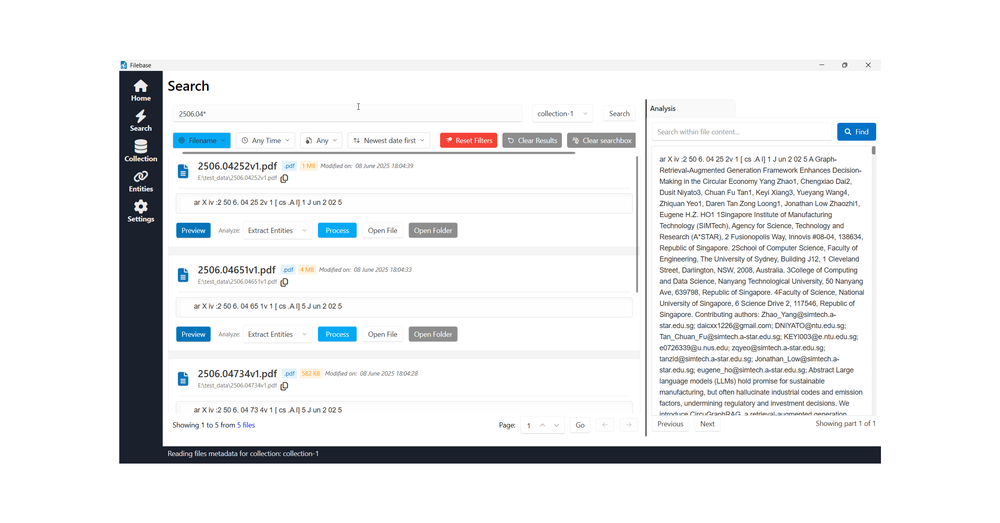
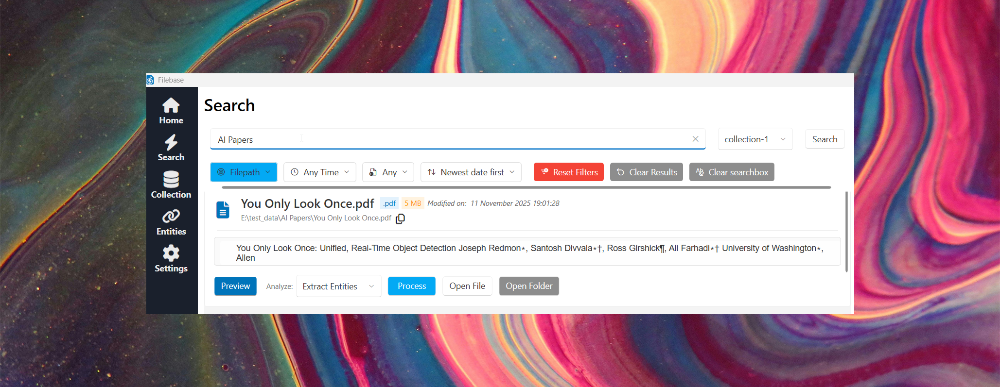
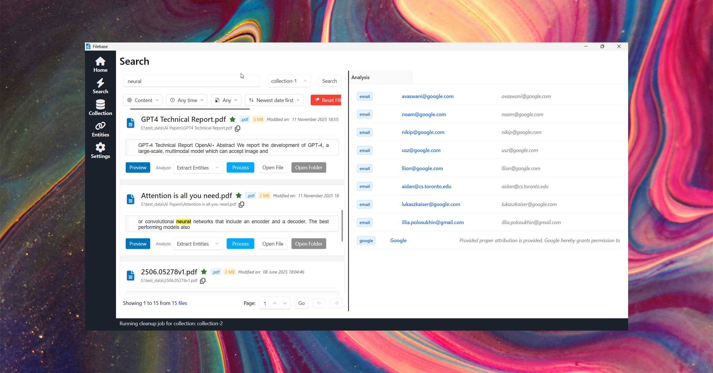
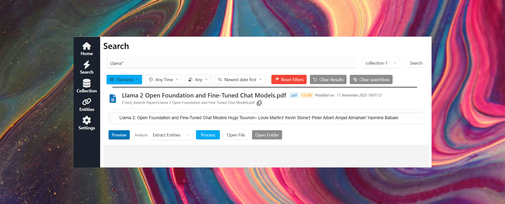

# 🚀 Filebase - Fast private file search

> Find files by content, instantly. Lightning-fast search powered by Apache Lucene with OCR support for images.
> Fast keyword search inside files with background content extraction and indexing.
> Preview files and extract important information.

---

## 📦 Features

- Instant full-text search across PDF, DOCX, XLSX, TXT and images (OCR).
- Lightning-fast Lucene-powered indexing with near-instant results.
- Keyword highlight and in-app preview with context-aware snippets.
- Simple filters: filename, extension, path, date range and file type.
- Wildcard and flexible pattern search (* and ? support).
- Background extraction & chunked indexing (Apache Tika integration).
- Fast entity extraction (emails, phones, dates) with custom patterns (Regex and string match).
- Folder monitoring and multiple collections.
- Search text inside images (Tesseract OCR integration).
- Offline-first and local-only indexing for privacy.
- Windows-native performance (.NET/C#) and low footprint.

---

## 🧠 Overview

Filebase is a private, high-performance file search app for Windows. It pre-indexes and extracts content from monitored folders in the background (using Lucene + Tika/OCR), returns near-instant search results, and keeps all data local so your files never leave your device. Search using filename, path, part of path and content of the file.

---

## 🚀 How to Install / How to Use

1. Buy the application from the official website: [Filebase](https://filebaseapp.com).
2. Install on Windows 10/11 (requires .NET runtime).
3. Install Java runtime and Tesseract (for OCR), and run the Tika server (for wide-format file extraction).
4. Add one or more folders (collections) to monitor — Filebase will index them in the background.
5. Type keywords or use filters to get instant results; click a result to open or view the highlighted in-app preview.
6. Use keywords, wildcards, and filters to refine searches.

(feedback helps improve features.)

---

## 💬 Feedback & Support

- [Request a Feature or Report a Bug](https://github.com/p-stackforge/Filebase-support/issues/new/choose)
- [Start a Discussion](https://github.com/p-stackforge/Filebase-support/discussions)

---

## 🖼️ Screenshots

 

 

 

 

---

## 🛣️ Roadmap

Current: v1.0 — Beta (this release)

| Version | Status  | Highlights |
|---------|---------|------------|
| v1.0    | RC    | First release - core search, indexing, OCR, previews |
| v1.1    | Planned | Local LLM Integration — summarize files and extract key points locally |
| v1.2    | Planned | Document QA — chat with your documents to answer questions |
| v1.3    | Planned | Format Filters — select which file formats to extract and index |
| v1.4    | Planned | Search improvements — improved filtering, regex & advanced queries |
| v1.5    | Planned | Natural Language Search — query using plain language powered by local LLMs |
| v1.6    | Planned | Native Extraction — boost extraction speed and reduce memory usage |

